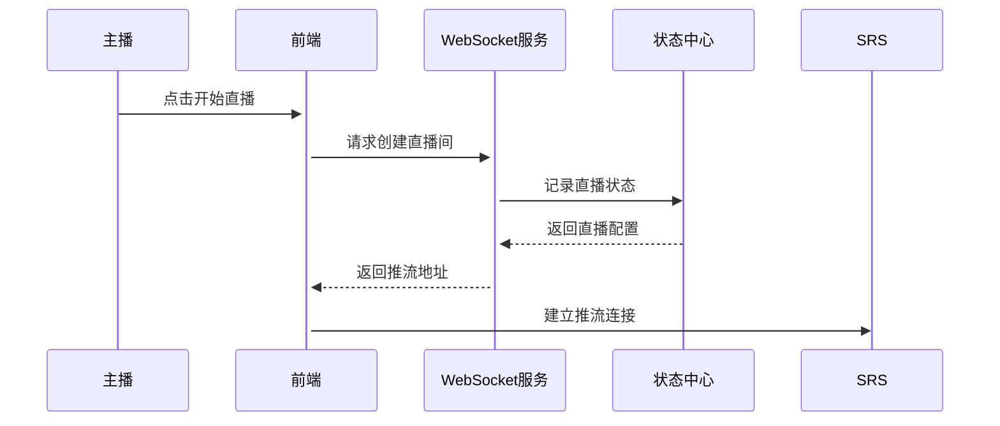
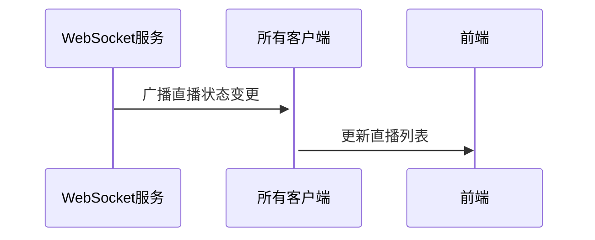
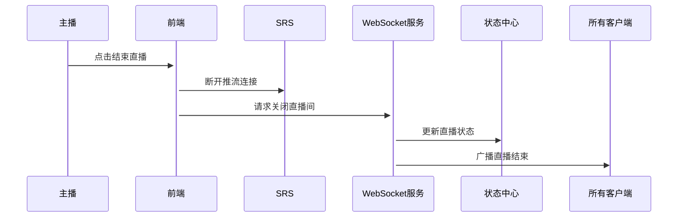
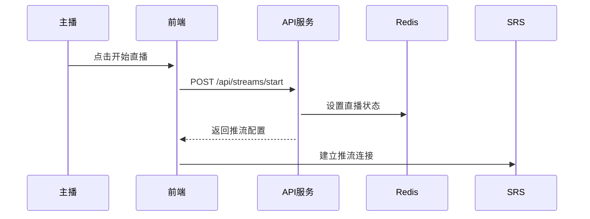
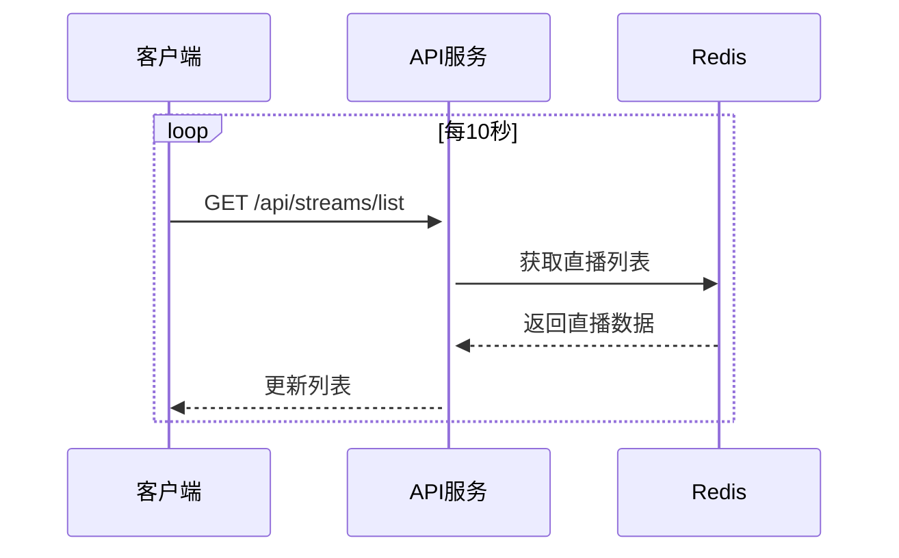
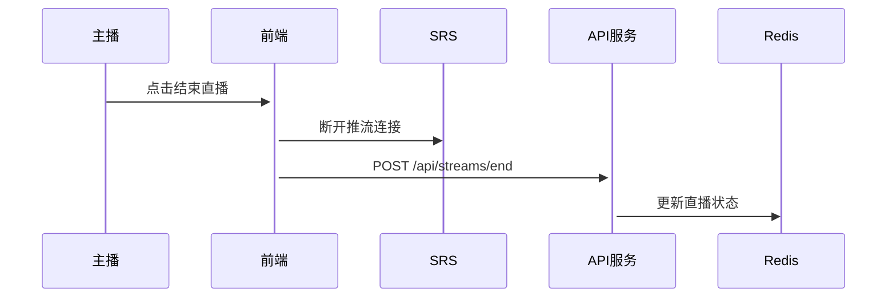
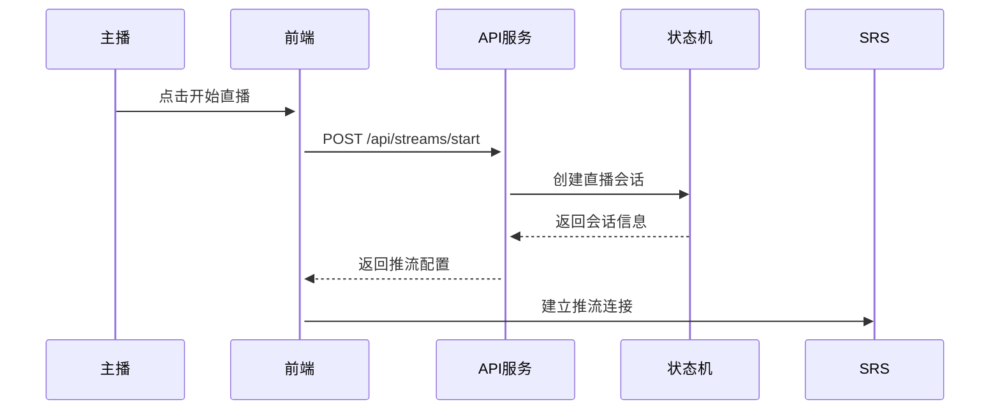
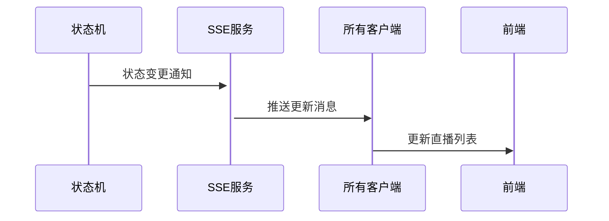
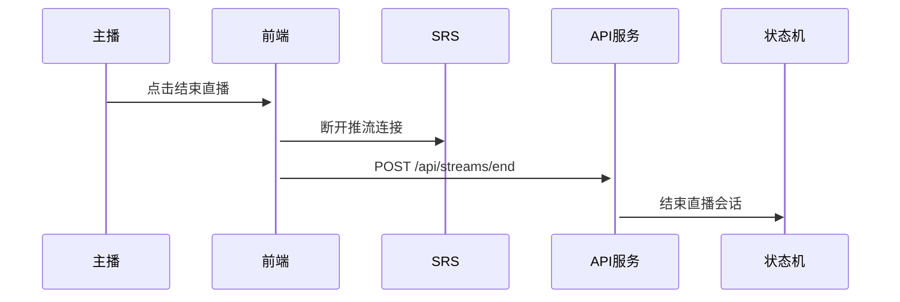

# 直播流程设计方案

## 方案一：WebSocket + 状态中心

### 架构设计
```
客户端 <-> WebSocket服务 <-> 状态中心 <-> SRS服务器
```

### 实现流程

1. 开始直播流程


2. 直播列表更新


3. 关闭直播流程


### 优点
1. 实时性好，状态更新快
2. 支持双向通信，便于扩展聊天等功能
3. 系统状态集中管理
4. 前端实现简单

### 缺点
1. 需要维护 WebSocket 连接
2. 服务端负载较高

## 方案二：轮询 + Redis

### 架构设计
```
客户端 <-> API服务 <-> Redis <-> SRS服务器
```

### 实现流程

1. 开始直播流程


2. 直播列表更新


3. 关闭直播流程


### 优点
1. 架构简单，易于实现
2. 服务端压力小
3. 不需要维护长连接
4. 容易扩展

### 缺点
1. 实时性相对较差
2. 需要处理轮询间隔

## 方案三：SSE + 状态机

### 架构设计
```
客户端 <-> SSE服务 <-> 状态机 <-> SRS服务器
```

### 实现流程

1. 开始直播


2. 状态更新


3. 关闭直播


### 优点
1. 单向推送，服务器压力小
2. 实时性好
3. 支持断线重连
4. 浏览器原生支持

### 缺点
1. 不支持双向通信
2. 某些代理可能不支持 SSE

## 推荐方案

建议采用 **方案一：WebSocket + 状态中心** 实现，原因如下：

1. 实时性要求
   - 直播场景需要及时的状态更新
   - 用户体验要求高
   - 后续可能需要添加聊天等功能

2. 实现复杂度
   - WebSocket 实现相对简单
   - 前端框架对 WebSocket 支持良好
   - 便于扩展其他实时功能

3. 开发效率
   - 状态管理集中
   - 代码结构清晰
   - 调试方便

### 具体实现步骤

1. 前端实现
```typescript
// 状态管理
const streamStore = defineStore('stream', {
  state: () => ({
    isLive: false,
    streamInfo: null,
    liveRooms: []
  }),
  actions: {
    async startStream() {
      // 创建直播间
    },
    async endStream() {
      // 结束直播
    },
    updateLiveRooms(rooms) {
      // 更新直播列表
    }
  }
})

// WebSocket 连接管理
class LiveService {
  connect() {
    // 建立 WebSocket 连接
  }

  startStream() {
    // 请求开始直播
  }

  endStream() {
    // 请求结束直播
  }
}
```

2. 后端实现
```typescript
// WebSocket 处理
class LiveHandler {
  onStart(client, data) {
    // 处理开播请求
  }

  onEnd(client, data) {
    // 处理关播请求
  }

  broadcastUpdate() {
    // 广播状态更新
  }
}

// 状态管理
class LiveStateManager {
  addStream(streamInfo) {
    // 添加直播流
  }

  removeStream(streamId) {
    // 移除直播流
  }

  getLiveStreams() {
    // 获取所有直播流
  }
}
```

### 注意事项

1. 错误处理
   - 推流失败处理
   - 断线重连机制
   - 状态同步

2. 性能优化
   - 消息压缩
   - 连接池管理
   - 缓存策略

3. 安全考虑
   - 身份验证
   - 权限控制
   - 数据加密
